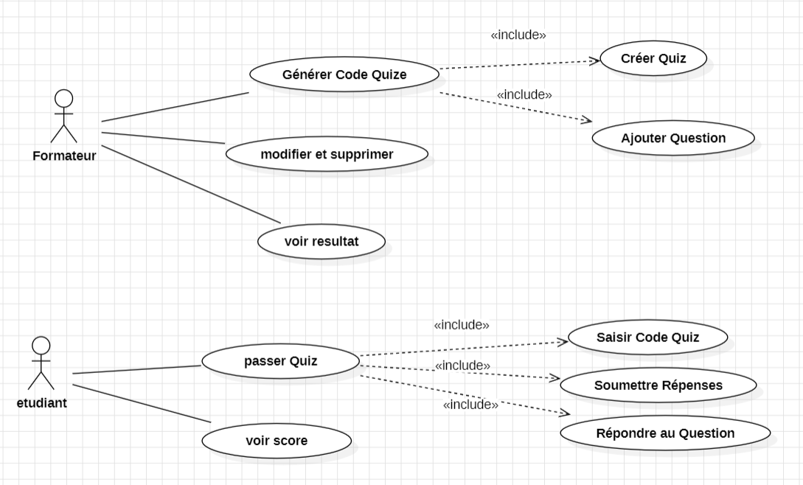

# EduQuize
screenshot des diagrammes :
,
,
.
# EduQuiz

*Description du Projet

EduQuiz est une plateforme web interne développée pour CodeAcademy afin de digitaliser les évaluations QCM des modules de formation (HTML, CSS, PHP).

Le système permet aux formateurs de créer des quiz rapidement et aux étudiants de passer les évaluations en ligne avec une correction automatique et un affichage instantané des résultats.

---

*Objectifs

- Réduire le temps de correction des formateurs.
- Automatiser le calcul des scores.
- Permettre aux étudiants de voir leurs résultats immédiatement.
- Centraliser les évaluations dans une plateforme sécurisée.

---

*Acteurs

*Formateur
- Créer des quiz
- Ajouter des questions
- Modifier/Supprimer des questions
- Générer un code d’accès
- Consulter les résultats
- Exporter les scores CSV

*Étudiant
- S’inscrire / Se connecter
- Accéder à un quiz via un code
- Répondre aux questions
- Voir le score final
- Consulter les corrections

---

*Technologies Utilisées

- PHP 8 (POO + Typage Strict)
- MySQL
- HTML5
- Tailwind CSS
- PDO (Singleton)
- Git & GitHub

---

# 📂 Structure du Projet

```bash
EduQuiz/
├── config/
│   └── Database.php
├── public/
│   ├── index.php
│   └── css/
├── src/
│   ├── Entities/
│   ├── Repositories/
│   ├── Services/
│   └── Views/
├── .env
├── .gitignore
└── tailwind.config.js

Sécurité
Hashage des mots de passe avec :
password_hash()
Vérification avec :
password_verify()

Sessions sécurisées PHP
Requêtes préparées PDO contre les injections SQL

*Architecture POO

-Entities
User
Role
Quiz
Question
Answer
Result

-Repositories
UserRepository
QuizRepository
QuestionRepository
ResultRepository

-Services
AuthService
QuizService
ScoreService

*Fonctionnalités

-Authentification
Inscription
Connexion
Gestion des rôles

-Gestion des Quiz
Création de quiz
Génération de code d’accès
Ajout de questions/réponses
Modification/Suppression

-Passage des Quiz
Accès par code
Réponse aux questions
Soumission du quiz
Résultats
Calcul automatique du score
Affichage des corrections
Dashboard des résultats

-Bonus
Temps limite
Limitation des tentatives
Export CSV

*Organisation du Travail
Gestion des tâches avec Jira
Versioning avec Git/GitHub
Travail collaboratif en groupe


